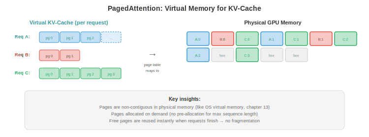

# Serving and Batching

*Serving an LLM to thousands of concurrent users requires more than loading a model and running inference. This file covers the prefill-decode split, continuous batching, PagedAttention and vLLM, scheduling strategies, disaggregated serving, multi-model and LoRA serving, and the metrics that matter *

- A single LLM inference request is simple: feed in tokens, generate output tokens. But serving an LLM to 10,000 concurrent users at low latency and high throughput is a systems problem. The naive approach (process one request at a time) wastes 90%+ of GPU capacity. Smart batching and scheduling can increase throughput 10-50x without adding hardware.

## Prefill vs Decode: Two Very Different Phases

- LLM inference has two distinct phases with fundamentally different computational characteristics:

- **Prefill** (prompt processing): process all input tokens simultaneously. This is a single large matrix multiplication: $O(\text{prompt\_length} \times d_{\text{model}}^2)$. The prompt can be processed in parallel (all tokens are known). Prefill is **compute-bound**: the GPU's ALUs are the bottleneck.

- **Decode** (token generation): generate one token at a time, autoregressively. Each new token requires attending to all previous tokens via the KV-cache. Decode is **memory-bandwidth-bound**: the GPU spends most time loading model weights and KV-cache from memory, not computing. Each decode step produces just one token but must load the entire model (~140 GB for a 70B model in FP16).

- The implications:

| | Prefill | Decode |
|--|---------|--------|
| Tokens processed | All at once (parallel) | One at a time (sequential) |
| Bottleneck | Compute (FLOPS) | Memory bandwidth |
| Arithmetic intensity | High | Very low |
| GPU utilisation | High (50-80%) | Low (1-10%) without batching |
| Latency metric | **Time to First Token (TTFT)** | **Time Per Output Token (TPOT)** |

- TTFT matters for user experience (how long until the response starts streaming). TPOT determines the perceived generation speed. Users tolerate higher TTFT (1-5 seconds) but expect fast TPOT (30-100 ms per token for conversational applications).

## Static Batching (Naive)

- The simplest batching: collect $B$ requests, pad them to the same length, process them as a single batch.

- **Problem 1**: requests have different prompt lengths and generate different numbers of output tokens. Short requests finish early but must wait for the longest request in the batch before the next batch can start. The GPU sits idle while generating for the one remaining long request.

- **Problem 2**: padding wastes compute. If the longest prompt is 2000 tokens and the shortest is 50, the batch is padded to 2000. The GPU processes 1950 padding tokens for the short request — pure waste.


## Continuous Batching

- **Continuous batching** (also called iteration-level batching) solves both problems by operating at the granularity of individual decode steps, not entire requests.

- At each decode step:
    1. All in-flight requests generate one token in parallel (as a batch).
    2. Requests that finish (generate EOS token) are **removed** from the batch immediately.
    3. New requests from the queue are **inserted** into the freed slots immediately.

- The batch size changes dynamically every step. The GPU is never idle waiting for stragglers, and there is no wasted padding (each request uses only the slots it needs).

- **Impact**: continuous batching typically increases throughput 2-10x over static batching, with no change to model quality or significant latency increase.

## PagedAttention and vLLM

- The KV-cache creates a memory management nightmare. Each request has a KV-cache that grows with each generated token. Different requests are at different stages (different cache sizes). Allocating contiguous memory for each request wastes space (you must allocate for the maximum possible length, even if the request generates only a few tokens).



- **PagedAttention** (Kwon et al., 2023) applies the OS concept of virtual memory (chapter 13) to the KV-cache. The cache is divided into fixed-size **pages** (blocks of token positions). Pages are allocated on demand and can be non-contiguous in physical GPU memory.

- The benefits:
    - **No fragmentation**: pages are uniform size, so there are no "holes" of wasted memory between requests.
    - **Lazy allocation**: memory is allocated only when tokens are actually generated, not pre-allocated for maximum length.
    - **Copy-on-write**: requests that share a common prefix (e.g., system prompts) share the same KV-cache pages. Only when the requests diverge are the pages copied.

- **vLLM** is the inference engine built around PagedAttention. It achieves 2-4x higher throughput than static-allocation serving (like HuggingFace's text-generation-inference without paged attention) by virtually eliminating KV-cache memory waste.

## Scheduling Strategies

- When multiple requests are waiting and the GPU can only process a limited batch, **scheduling** decides which requests to serve:

- **First Come First Served (FCFS)**: process requests in arrival order. Simple but unfair: a user submitting a 10K-token generation blocks all users behind them.

- **Shortest Job First (SJF)**: process the request that will finish soonest. Minimises average latency but penalises long-running requests (they may starve). In practice, estimated output length is unknown, so SJF uses heuristics (prompt length, user history).

- **Preemption**: if a high-priority request arrives, pause a lower-priority in-progress request (swap its KV-cache to CPU memory or SSD), serve the high-priority request, then resume the paused one. vLLM supports this.

- **Priority-based**: assign priorities to users or request types. Real-time interactive queries get higher priority than batch processing jobs. Combined with preemption, this ensures latency SLOs for high-priority traffic.

- **Token budget**: limit the total number of tokens in the active batch. This prevents a few long requests from monopolising GPU memory and starving new requests.

## Disaggregated Serving

- Prefill and decode have opposite computational profiles. Running both on the same GPU means the GPU alternates between being compute-bound (prefill) and memory-bandwidth-bound (decode), never fully utilising either resource.

- **Disaggregated serving** separates them:
    - **Prefill nodes**: GPUs optimised for compute (high FLOPS, possibly with less memory). Process all incoming prompts.
    - **Decode nodes**: GPUs optimised for memory bandwidth (large KV-cache capacity, high memory bandwidth). Handle all token generation.

- The prefill node computes the initial KV-cache and sends it to the decode node (over NVLink or network). The decode node generates tokens using the received cache.

- This is the architecture of **Mooncake** (Moonshot AI) and is being explored by several LLM serving teams. The benefit: each GPU type is matched to its workload characteristics, improving overall utilisation.

## Multi-Model and LoRA Serving

- In production, you often serve multiple models (different sizes for different tiers, different fine-tuned variants for different tasks).

- **Model multiplexing**: load multiple models on the same GPU and route requests to the appropriate model. GPU memory is shared: a 40 GB GPU might hold a 13B model (26 GB) and a 7B model (14 GB) simultaneously.

- **LoRA serving**: instead of deploying separate fine-tuned models, deploy one base model with multiple **LoRA adapters** (chapter 6). Each adapter adds <1% parameters. Requests are routed to the appropriate adapter at inference time.

- **S-LoRA** (Sheng et al., 2023): serves thousands of LoRA adapters from a single base model. Adapters are stored on CPU and paged into GPU memory on demand. The base model's KV-cache and weights are shared; only the small LoRA matrices differ per request.

- **Punica** (Chen et al., 2023): batches requests across different LoRA adapters by using a custom CUDA kernel that applies different LoRA matrices to different requests within the same batch. This avoids the overhead of switching adapters per request.

## Constrained and Guided Generation

- Many applications need the LLM to produce output in a specific format: valid JSON, SQL queries, code in a particular language, or responses that follow a schema. **Constrained generation** guarantees the output conforms to a grammar or schema.

- **Grammar-constrained decoding**: at each decoding step, mask out tokens that would violate the grammar. If the output so far is `{"name": "Alice", "age":` and the grammar requires an integer next, mask all tokens except digits. The LLM's probability distribution is renormalised over the valid tokens.

- **Outlines** (Willard & Louf, 2023): compiles a JSON schema or regular expression into a finite-state machine (FSM). At each decoding step, the FSM determines which tokens are valid continuations. Invalid tokens get probability 0. This guarantees 100% schema compliance with zero retries.

- **SGLang** integrates constrained generation natively: you specify the output structure in Python, and the engine handles the token masking and caching efficiently. This is combined with RadixAttention (prefix caching) so that structured outputs reuse cached prefixes.

- **Why it matters**: without constrained generation, you generate freely and parse the output, retrying on failure. Retry rates of 10-30% are common for complex JSON schemas, wasting compute. Constrained generation eliminates retries entirely.

## Request Routing

- Not every query needs the biggest model. **Request routing** directs queries to different models based on estimated difficulty:

- **Cascading**: try a small model first. If the small model's confidence is below a threshold (e.g., the softmax probability of the top token is < 0.8), escalate to a larger model. Easy queries (80%+ of traffic) are served cheaply by the small model; only hard queries use the expensive model.

- **Learned routing**: train a lightweight classifier (or use the small model's perplexity) to predict which model tier a query needs. Route "What is 2+2?" to a 3B model and "Explain the mathematical foundations of quantum entanglement" to a 70B model.

- **Impact**: if 80% of queries can be handled by a model that costs 10x less, the average cost per query drops by ~70%. This is one of the highest-impact cost optimisations for multi-model deployments.

## Inference Metrics

- The right metrics depend on the use case:

| Metric | What It Measures | Target (Conversational) | Target (Batch) |
|--------|-----------------|------------------------|-----------------|
| **TTFT** | Time to first token | <1 s | less important |
| **TPOT** | Time per output token | <100 ms | less important |
| **Throughput** | Tokens/second (total) | less important | maximise |
| **p99 Latency** | Worst 1% of requests | <5 s | <30 s |
| **Cost per token** | $/1M tokens | minimise | minimise |
| **SLO compliance** | % of requests meeting latency target | >99% | >95% |

- **TTFT vs TPOT tradeoff**: aggressive batching increases throughput (more tokens/s total) but increases TPOT (each token takes longer because the GPU processes more requests). The scheduling strategy must balance throughput (revenue) against latency (user experience).

- **Cost per token** is the ultimate metric for production. It combines hardware cost (GPU rental), throughput (tokens/s), and utilisation. A system running at 50% GPU utilisation costs 2x more per token than one at 100%. This is why batching, scheduling, and PagedAttention matter so much — they increase utilisation.

## Coding Tasks (use CoLab or notebook)

1. Simulate continuous vs static batching and measure the throughput difference.
```python
import random
import time

def simulate_static_batching(requests, batch_size=8):
    """Process requests in fixed batches. Wait for all to finish."""
    total_tokens = 0
    total_time = 0

    for i in range(0, len(requests), batch_size):
        batch = requests[i:i + batch_size]
        max_len = max(r['output_len'] for r in batch)
        # All requests in the batch take as long as the longest
        batch_time = max_len * 0.01  # 10ms per token
        total_time += batch_time
        total_tokens += sum(r['output_len'] for r in batch)

    return total_tokens / total_time  # tokens per second

def simulate_continuous_batching(requests, max_batch=8):
    """Process with continuous batching. Remove finished, add new."""
    total_tokens = 0
    total_time = 0
    active = []
    queue = list(requests)

    while active or queue:
        # Fill batch
        while len(active) < max_batch and queue:
            active.append({'remaining': queue.pop(0)['output_len']})

        if not active:
            break

        # One decode step: all active requests generate 1 token
        for req in active:
            req['remaining'] -= 1
        total_tokens += len(active)
        total_time += 0.01  # 10ms per step

        # Remove finished requests
        active = [r for r in active if r['remaining'] > 0]

    return total_tokens / total_time

# Generate requests with varied output lengths
random.seed(42)
requests = [{'output_len': random.randint(10, 500)} for _ in range(100)]

static_tps = simulate_static_batching(requests)
continuous_tps = simulate_continuous_batching(requests)

print(f"Static batching:     {static_tps:.0f} tokens/s")
print(f"Continuous batching: {continuous_tps:.0f} tokens/s")
print(f"Speedup: {continuous_tps / static_tps:.1f}x")
```

2. Calculate the KV-cache memory savings from PagedAttention. Compare pre-allocated (worst case) vs paged (actual usage).
```python
def paged_vs_preallocated(n_requests, max_seq_len, avg_seq_len, page_size, kv_per_token_bytes):
    """Compare memory usage: preallocated vs paged KV-cache."""
    # Preallocated: every request gets max_seq_len slots
    preallocated_gb = n_requests * max_seq_len * kv_per_token_bytes / 1e9

    # Paged: allocate only what is used (with page granularity)
    import math
    avg_pages = math.ceil(avg_seq_len / page_size)
    paged_gb = n_requests * avg_pages * page_size * kv_per_token_bytes / 1e9

    waste_preallocated = (max_seq_len - avg_seq_len) / max_seq_len
    waste_paged = (avg_pages * page_size - avg_seq_len) / (avg_pages * page_size)

    print(f"Requests: {n_requests}, Max seq: {max_seq_len}, Avg seq: {avg_seq_len}")
    print(f"  Preallocated: {preallocated_gb:.1f} GB (waste: {waste_preallocated:.0%})")
    print(f"  Paged:        {paged_gb:.1f} GB (waste: {waste_paged:.0%})")
    print(f"  Savings:      {preallocated_gb - paged_gb:.1f} GB ({preallocated_gb/paged_gb:.1f}x)")
    print()

# Llama-70B: ~1.3 KB per token per layer, 80 layers = ~100 KB per token total
kv_bytes = 100_000

# Scenario 1: short requests, large max
paged_vs_preallocated(256, max_seq_len=4096, avg_seq_len=256, page_size=16, kv_per_token_bytes=kv_bytes)

# Scenario 2: varied lengths
paged_vs_preallocated(256, max_seq_len=8192, avg_seq_len=1024, page_size=16, kv_per_token_bytes=kv_bytes)

# Scenario 3: long context
paged_vs_preallocated(64, max_seq_len=131072, avg_seq_len=16000, page_size=16, kv_per_token_bytes=kv_bytes)
```
